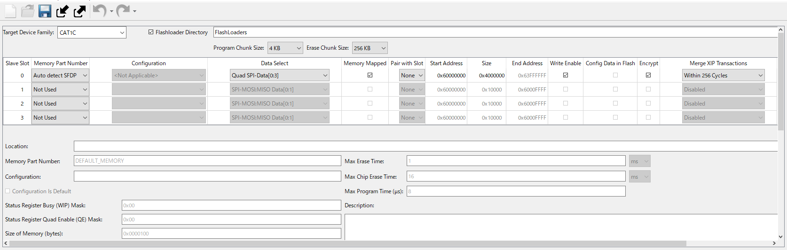
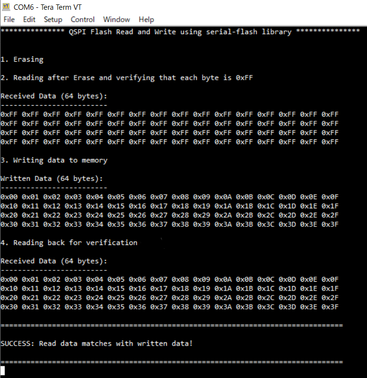

# SMIF QSPI Flash Read Write
**This example demonstrates interfacing with an external NOR flash memory in Quad SPI (QSPI) mode using the serial memory interface (SMIF) in Infineon MCU.**  

## Device
The device used in this code example (CE) is:
- [TRAVEO™ T2G CYT4BF Series](https://www.infineon.com/cms/en/product/microcontroller/32-bit-traveo-t2g-arm-cortex-microcontroller/32-bit-traveo-t2g-arm-cortex-for-body/traveo-t2g-cyt4bf-series/)

## Board
The board used for testing is:
- TRAVEO™ T2G evaluation kit ([KIT_T2G-B-H_EVK](https://www.infineon.com/cms/en/product/evaluation-boards/kit_t2g-b-h_evk/), [KIT_T2G-B-H_LITE](https://www.infineon.com/cms/en/product/evaluation-boards/kit_t2g-b-h_lite/))

## Scope of work
This code example configures the QSPI flash memory mounted on the board with the QSPI Configurator and accesses it via the serial-flash library.

## Introduction  

**Serial Memory Interface**  
The Serial Memory InterFace (SMIF) block is a master that provides a low pin count connection to off-chip (single/dual/quad/octal) SPI devices, such as EEPROM, FRAM, MRAM, or NAND in SDR or DDR mode, and HyperBus devices such as HyperFlash (NOR flash) and HyperRAM (PSRAM and pseudo static RAM).
- SPI or HyperBus master functionality only
- HyperBus protocol
- SPI protocol
    - SPI mode 0 only, with configurable MISO sampling timing
    - Supports single/dual/quad/octal SPI
    - Supports dual-quad SPI mode
    - Supports single data rate (SDR) and dual data rate (DDR) transfers
- Memory device
    - Supports overall device capacity in the range of 64 KB to 4 GB in power of two multiples
    - Supports configurable external device capacities
    - Supports two external memory devices
- Memory mapped I/O (MMIO) operation mode
- XIP mode
    - eXecute-In-Place (XIP) operation mode for both read and write accesses
    - XIP mode supports on-the-fly encryption and decryption
    - XIP operation mode via AHB interface for CM0 and AXI interface for CM7 core
    - Supports up to four outstanding transactions
- Memory interface logic 
    - Supports stalling of SPI and HyperBus transfers to address back pressure on FIFOs
    - Supports an asynchronous SPI/HyperBus transmit and receive interface clock
    - Supports read-write-data-strobe (RWDS)
    - Supports multiple interface receive clocks
    - Supports flexible external SPI memory devices data signal connections
    - Independent SPI interface transmitter clock from PLL/FLL
    - SPI interface logic supports flexible external memory devices data signal connections

More details can be found in [Technical Reference Manual (TRM)](https://www.infineon.com/dgdl/?fileId=5546d4627600a6bc017600bfae720007), [Registers TRM](https://www.infineon.com/dgdl/?fileId=5546d4627600a6bc017600be2aef0004) and [Data Sheet](https://www.infineon.com/dgdl/?fileId=5546d46275b79adb0175dc8387f93228).

## Hardware setup
This CE has been developed for:
- TRAVEO™ T2G evaluation kit ([KIT_T2G-B-H_EVK](https://www.infineon.com/cms/en/product/evaluation-boards/kit_t2g-b-h_evk/)) 
 
No changes are required from the board's default settings.

- TRAVEO™ T2G Body High Lite evaluation kit ([KIT_T2G-B-H_LITE](https://www.infineon.com/cms/en/product/evaluation-boards/kit_t2g-b-h_lite/)) 
 
No changes are required from the board's default settings.

## Implementation
This example uses the QSPI hardware block for interfacing with the external memory through four data lines and one slave select line. This example writes 64 bytes of data to the external memory in QSPI mode. The written data is read back to check its integrity. The UART resource outputs the debug information to a terminal window. A user LED indicates the status of the read and write operation.

**STDOUT setting**

Initialization of the GPIO for UART is done in the <a href="https://infineon.github.io/retarget-io/html/group__group__board__libs.html#ga21265301bf6e9239845227c2aead9293"><i>cy_retarget_io_init()</i></a> function.
- Initialize the pin specified by CYBSP_DEBUG_UART_TX as UART TX, the pin specified by CYBSP_DEBUG_UART_RX as UART RX (these pins are connected to KitProg3 COM port)
- The serial port parameters become to 8N1 and 115200 baud

**GPIO control**

Initialization of the GPIO port pin is done once in the <a href="https://infineon.github.io/mtb-hal-cat1/html/group__group__hal__gpio.html#gab93322030909d3af6a9fc1a3b2eccbaa"><i>cyhal_gpio_init()</i></a> function.
- Initialize the pin specified by *CYBSP_USER_LED* as output (initial level = H, LED turns off)

When the processing of this CE finishes successfully, the user LED is blinked by calling  <a href="https://infineon.github.io/psoc6hal/html/group__group__hal__gpio.html#gacf9c6cb7d4f6f25828a62d44648b745d"><i>cyhal_gpio_toggle()</i></a>. 

**Accessing the QSPI flash memory**
- The initialization of SMIF is done in *cy_serial_flash_qspi_init()* function.
  - The first argument is the configuration that configured by QSPI Configurator:
  
  - The second and subsequent arguments specify the pins and clock to connect the QSPI flash memory
- After that, calling *cy_serial_flash_qspi_erase()* function to erase the target sector.
  - The first argument is the target address, and the second is the size
  - Then, read back the data from erased address by calling *cy_serial_flash_qspi_read()* to ensure that the target area is erased
- Next, calling *cy_serial_flash_qspi_write()* function to write data to the erased region.
  - The first argument is the target address, the second is the size and the third is the data to be written
  - Same as after the erase, read back the data from written address by calling *cy_serial_flash_qspi_read()* to ensure that the target area contains the appropriate value

## Run and Test
For this example, a terminal emulator is required for displaying outputs. Install a terminal emulator if you do not have one. Instructions in this document use [Tera Term](https://ttssh2.osdn.jp/index.html.en).

After code compilation, perform the following steps to flashing the device:
1. Connect the board to your PC using the provided USB cable through the KitProg3 USB connector.
2. Open a terminal program and select the KitProg3 COM port. Set the serial port parameters to 8N1 and 115200 baud.
3. Program the board using one of the following:
    - Select the code example project in the Project Explorer.
    - In the **Quick Panel**, scroll down, and click **[Project Name] Program (KitProg3_MiniProg4)**.
4. After programming, the code example starts automatically. Confirm that the messages are displayed on the UART terminal.

    - *Terminal output on program startup*  If the read-back could succeed, the user LED should do blink with 1 sec interval.

5. You can debug the example to step through the code. In the IDE, use the **[Project Name] Debug (KitProg3_MiniProg4)** configuration in the **Quick Panel**. For details, see the "Program and debug" section in the [Eclipse IDE for ModusToolbox™ software user guide](https://www.infineon.com/dgdl/?fileId=8ac78c8c8386267f0183a8d7043b58ee).

**Note:** **(Only while debugging)** On the CM7 CPU, some code in *main()* may execute before the debugger halts at the beginning of *main()*. This means that some code executes twice: once before the debugger stops execution, and again after the debugger resets the program counter to the beginning of *main()*. See [KBA231071](https://community.infineon.com/t5/Knowledge-Base-Articles/PSoC-6-MCU-Code-in-main-executes-before-the-debugger-halts-at-the-first-line-of/ta-p/253856) to learn about this and for the workaround.

## References  

Relevant Application notes are:
- AN235305 - GETTING STARTED WITH TRAVEO™ T2G FAMILY MCUS IN MODUSTOOLBOX™
- [AN224454](https://www.infineon.com/dgdl/?fileId=5546d462749a7c2d01749b3510f50cd4) - Using the SMIF in Traveo II Family

ModusToolbox™ is available online:
- <https://www.infineon.com/modustoolbox>

Associated TRAVEO™ T2G MCUs can be found on:
- <https://www.infineon.com/cms/en/product/microcontroller/32-bit-traveo-t2g-arm-cortex-microcontroller/>

More code examples can be found on the GIT repository:
- [TRAVEO™ T2G Code examples](https://github.com/orgs/Infineon/repositories?q=mtb-t2g-&type=all&language=&sort=)

For additional trainings, visit our webpage:  
- [TRAVEO™ T2G trainings](https://www.infineon.com/cms/en/product/microcontroller/32-bit-traveo-t2g-arm-cortex-microcontroller/32-bit-traveo-t2g-arm-cortex-for-body/traveo-t2g-cyt4bf-series/#!trainings)

For questions and support, use the TRAVEO™ T2G Forum:  
- <https://community.infineon.com/t5/TRAVEO-T2G/bd-p/TraveoII>  
